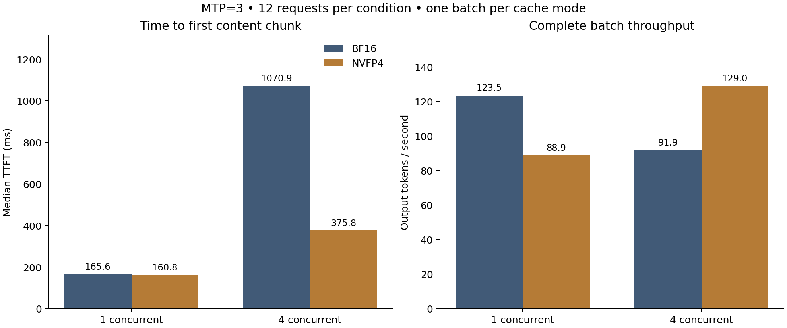
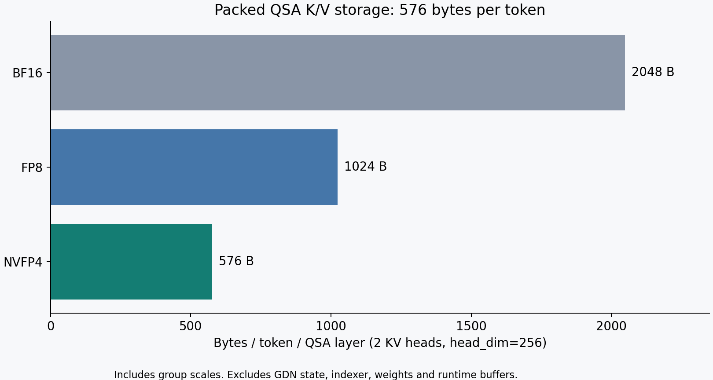

# NVFP4 QSA

**Packed KV-cache storage, sparse attention kernels and hybrid-cache accounting for a Qwen serving stack.**

Implemented and evaluated by **Yuri Pocepaev**.

NVFP4 QSA packs the main attention K/V into **576 bytes per token per layer**, including group scales. It provides a standalone Python package, Triton write/read kernels, an independent codec, and a vLLM integration patch candidate.

The paired server evaluation reported **2.32x the planner token pool** at nearly equal KV-cache budgets. Speed was mixed, and two answers changed in the small quality evaluation. This repository includes the raw observations and the limits of that comparison.

## Status

| Component | Validated scope |
|---|---|
| Portable package | 16 tests passed: 9 CPU and 7 GPU cases on RTX 4050 Laptop |
| Model-specific serving build | Paired BF16/NVFP4 evaluation on RTX PRO 6000 Blackwell |
| Public vLLM port | Patch application and physical-spec checks pass; full server run unverified |

This is an experimental cache component. It includes no model weights. The public port and the model-specific build used for the server measurements are different integrations.

## Latest server results

September 25, 2026 (UTC). Same checkpoint, MTP=3, maximum model length 169,984, up to 12 sequences, scheduler budget 8,192 and float32 recurrent state.

| KV format | KV budget | Planner token pool | Sequential output | Four concurrent requests |
|---|---:|---:|---:|---:|
| BF16 | 5.85 GiB | 189,904 | 123.48 tok/s | 91.88 tok/s |
| NVFP4 | 5.84 GiB | 439,958 | 88.91 tok/s | 129.02 tok/s |

Throughput is total output tokens divided by complete batch wall time. Each speed condition contains 12 requests generating 128 tokens, with one measured batch. The four-way condition was not independently warmed. NVFP4 ran first, BF16 second, on a shared host. These observations do not establish a universal speedup or sustained full-window concurrency.

Both modes scored **37/48** on selected classification examples and **9/9** on synthetic code retrieval. **55/57 answers matched**: one classification answer improved and one regressed. Retrieval inputs reached 9,280 tokens. Equal aggregate accuracy does not establish quality equivalence.



See [methods and quality results](docs/current-evaluation.md), [raw observations](results/2026-09-25/), and [benchmark reconstruction](benchmarks/window/README.md). Historical August measurements use different settings and are documented in [the historical report](docs/report.md).

## Quick start

From a local checkout, install a CUDA-enabled PyTorch build appropriate for your system, then install this package:

```bash
# Linux
python -m pip install ".[test,gpu-linux]"

# Windows: use this instead
python -m pip install ".[test,gpu-windows]"

python examples/packed_cache.py
python -m pytest tests -q
```

The package is installed from this checkout; these commands do not assume a PyPI release. No vLLM installation or model download is needed for the portable example.

The checked API supports BF16 queries with 24 query heads, two KV heads and head dimension 256. It validates inputs using host-synchronizing checks and rejects CUDA graph capture. Direct kernel callers own stream ordering and buffer lifetime. See [installation, complete API example and public-port instructions](docs/installation.md).

For CPU-only contract checks:

```bash
python -m pip install -r requirements-cpu.txt
python -m pytest tests/test_cpu_contracts.py tests/test_public_port_contract.py tests/unit -q
```

## How the storage works


The inspected model configuration has 48 layers: **36 linear-attention layers and
12 full-attention layers**, repeating three linear layers followed by one full
layer. The full-attention path uses QSA sparse selection. This work changes its
main K/V storage; recurrent state remains float32 in the observed server config.

For two KV heads and head dimension 256:

| Main K/V format | Bytes/token/layer | Relative capacity at equal K/V bytes |
|---|---:|---:|
| BF16 | 2,048 | 1.00x |
| FP8 | 1,024 | 2.00x |
| NVFP4 packed + scales | 576 | 3.56x |

The NVFP4 allocation is 43.75% smaller than FP8, or 1.78x as many main-K/V tokens
at the same byte budget. **These are storage arithmetic, not measured whole-server
capacity or throughput improvements.** GDN state, indexer state, weights, draft
model, graph buffers, padding and other allocations are outside this ratio.



## Format and planner fix

Each 256-element K or V vector contains 128 packed data bytes and 16 FP8 E4M3
group-scale bytes. Each group has 16 FP4 E2M1 values. The low nibble stores element
`2j`; the high nibble stores `2j+1`. Global K/V scales must stay fixed while a
cache is live. The integration snapshot initializes both to `1.0`.

The planner initially used the logical 1,024-byte width while the allocation used
576 bytes. Its 3,136-token page consequently held only 1,806,336 physical bytes,
less than the 3,207,168-byte recurrent-state page. Backend `customize_spec()`
exposes `state_content_bytes=288` per head before block-size adjustment. With
two heads, **5,568 x 576 = 3,207,168 bytes**. This is specific to the inspected
configuration, not a universal page size. See [the inspected integration snapshot](integration/snapshot/qsa.py).

## Repository guide

| Path | Contents |
|---|---|
| [python/nvfp4_qsa](python/nvfp4_qsa/) | Installable guarded API, kernels and independent codec |
| [examples](examples/) | Minimal runnable CUDA example |
| [tests](tests/) | CPU contracts and portable GPU checks |
| [integration](integration/README.md) | Public port candidate and separately identified serving snapshot |
| [benchmarks/window](benchmarks/window/README.md) | Pinned evaluation inputs and request client |
| [results](results/) | Dated measurements, summaries and raw answers |
| [environment](environment/) | Versions, selected configuration and provenance |
| [src](src/) and [slice5/src](slice5/src/) | Historical kernel validation and boundary checks |
| [deployment/vllm/native_nvfp4](deployment/vllm/native_nvfp4/) | Separate B12x/MTP integration work |

To regenerate figures and reports from saved results:

```bash
python -m pip install ".[report]"
python tools/render_report.py
python tools/summarize_current.py
python tools/render_current_report.py
```

These commands do not send inference requests. Full-model evaluation requires a separately configured endpoint and the matching server build.

## Known limits

- The complete public vLLM port has not been validated by a server run.
- BF16 startup with MTP disabled failed in two attempts, including eager mode. The successful paired runs used MTP=3.
- No matched FP8 serving result was collected in the September window.
- Small quality subsets and single measured speed batches need broader follow-up.
- Main-K/V storage ratios do not describe total GPU memory use; recurrent state, indexer state, weights and other buffers remain separate.
- Historical codec tests and integrated serving use different global-scale selection policies, documented in [the evidence report](docs/report.md).

## Contributing and provenance

See [CONTRIBUTING.md](CONTRIBUTING.md) for reporting a reproducible failure and checking a change. Source provenance is recorded in [SOURCE_MANIFEST.json](SOURCE_MANIFEST.json) and [PORTABLE_SOURCE_MANIFEST.json](PORTABLE_SOURCE_MANIFEST.json). `SHA256SUMS` inventories distributed files.

## License

Apache-2.0 for the code, with existing vLLM notices retained. See [LICENSE](LICENSE) and [NOTICE](NOTICE). External model checkpoints and datasets retain their own licenses. No model weights, vendor binaries, private deployment credentials or full production logs are included.

Independent engineering work; this is not an official vLLM, NVIDIA or FlashInfer release.
