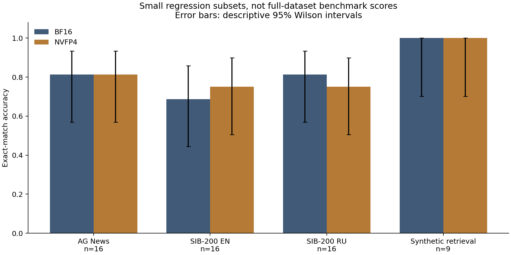

## Fresh server evaluation: September 25, 2026 (UTC)

The serving model was temporarily stopped after its active and waiting request
counts reached zero. Evaluation used an isolated container on the same RTX PRO
6000 Blackwell, with no production traffic routed to it. The other services were
left running; a residual GPU process used approximately 712 MiB before the window.
This is a controlled application comparison on a shared host, not an otherwise
empty laboratory machine.

The completed runs use the same checkpoint, MTP=3, maximum length 169,984,
maximum sequences 12, scheduler budget 8,192, memory utilization 0.94 and float32
recurrent state. CUDA graphs and compilation are enabled. The cache mode is the
changed parameter. The wrapper's persisted MTP choice was inspected rather than
assuming its command-line value was effective.

| Cache | Available KV budget | Reported planner token pool |
|---|---:|---:|
| NVFP4 | 5.84 GiB | 439,958 |
| BF16 | 5.85 GiB | 189,904 |

The reported planner pool is about 2.32 times larger with NVFP4 than BF16 at a nearly equal KV budget. This is an allocator observation, not demonstrated sustained full-context concurrency or a 2.32x total-VRAM reduction.

| KV cache | Concurrency | Requests | Median TTFT | Batch E2E output | Errors |
|---|---:|---:|---:|---:|---:|
| BF16 | 1 | 12 | 165.6 ms | 123.48 tok/s | 0 |
| BF16 | 4 | 12 | 1070.9 ms | 91.88 tok/s | 0 |
| NVFP4 | 1 | 12 | 160.8 ms | 88.91 tok/s | 0 |
| NVFP4 | 4 | 12 | 375.8 ms | 129.02 tok/s | 0 |

| Task | BF16 | NVFP4 |
|---|---:|---:|
| ag_news | 13/16 | 13/16 |
| sib200_en | 11/16 | 12/16 |
| sib200_ru | 13/16 | 12/16 |
| synthetic_needle | 9/9 | 9/9 |

Each quality subset has 16 examples selected before evaluation from a pinned
AG News or SIB-200 test file. Nine synthetic retrieval prompts place a code at
three positions in three text sizes. The maximum observed input is 9,280 tokens;
this does not validate retrieval at 120K. Exact stripped answers are scored,
including formatting compliance. Raw answers and token counts are retained.
Wilson intervals are included in the JSON and chart to show how uncertain these
small subset scores are. They are descriptive and do not account for dataset
dependence or prove quality equivalence.

For speed, two single-request warmups precede evaluation. There are 12 requests
per concurrency, each requesting 128 output tokens with ignore_eos. Concurrency
four is not independently warmed before its measured batch. Unique user-message
prefixes reduce whole-request reuse; shared chat-template prefix caching remains
enabled. TTFT means first nonempty content chunk. Batch throughput divides actual
output tokens by the complete client batch wall time, including queueing and
client overhead. These are one-batch observations, not stable p95 or pure kernel
performance. The order was NVFP4 then BF16; FP8 was not measured.
There was no randomized repeated crossover.

Earlier BF16 baseline attempts with MTP disabled failed during startup with a CUDA illegal
memory access, both with compilation and in eager mode. They produced no task
scores or timing samples. A standalone GDN warmup with the same head dimensions
passed on Blackwell; that does not isolate the earlier fault. The failed
configurations remain an integration regression to investigate. The completed
MTP=3 runs must not be described as validation of the MTP=0 path.

The two modes produced the same stripped answer on 55/57 cases. NVFP4 corrected 1 BF16 error and changed 1 BF16-correct answer to an error. Equal aggregate accuracy does not establish equivalence.
